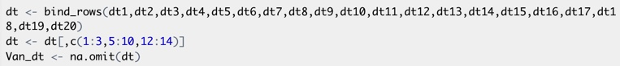
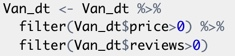
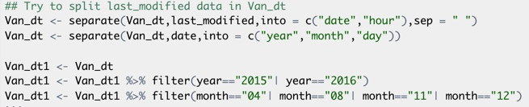
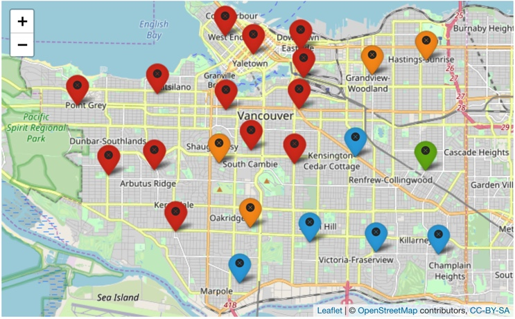

## I. Abstract:  

Travel becomes more popular than before, because of releasing pressure during daily life. But traveler is likely to consider the price and quality of the accommodation as their first two concern. The company Airbnb provides information about the accommodations and it is easy for travelers to choose positions by themselves. For this project, its focus on analyzing the price of accommodations based on different variables, such as room types, number of reviews, neighborhoods, etc.  Furthermore, the project focuses on the relationships between crime numbers and price of accomodations. To be specific, in order to analyze, the whole project is about EDA. For EDA, it is about finding the relationships between variables, and it also shows the changes in one specific variable based on different years or different conditions. Thus, the trend of changes is visible. 

## II. Introduction:  

# 2.1 Background:  

Airbnb is an online marketplace for arranging or offering lodging, primarily homestays, or tourism experiences. After founded, Airbnb became famous and popular because of the traveling trend. For travelers, they tend to consider price, satisfaction, review and safety as their concerns. Thus, I would like to do analyses such as EDA  to find out the relationships between price and other factors and whether the place is safe of not. It will helpful for travelers to predict the price by themselves.

# 2.2 Data Sources:  

The datasets I used for performing the analysis,'Airbnb Data Collection: Get the Data','Crime', which are particular in Vancouver, are obtained from the Tomslee website and Kaggle website. But, actually, the dataset is not integrated, which means airbnb only includes years from 2015 to 2017. And for the data in 2015 and 2017 have 4 months, so I cannot compare these 3 years directly. 

```{r setup, include=FALSE,echo=FALSE}
knitr::opts_chunk$set(echo = TRUE)
library(readxl)
library(dplyr)
library(esquisse)
library(ggmap)
library(mapdata)
library(tidytext)
library(tm)
library(SnowballC)
library(wordcloud)
library(RColorBrewer)
library(RCurl)
library(XML)
library(wordcloud2)
library(knitr)
library(esquisse)
library(sqldf)
library(dummies)
library(forecast)
library(ggplot2)
library(tidyverse)
library(magrittr)
library(ggpubr)
```

```{r,echo=FALSE,warning=FALSE}
dt1 <- read.csv(file ="tomslee_airbnb_vancouver_bc_0113_2015-04-25.csv",header = TRUE)
dt2 <- read.csv(file = "tomslee_airbnb_vancouver_bc_0139_2015-08-22.csv",header = TRUE)
dt3 <- read.csv(file = "tomslee_airbnb_vancouver_bc_0214_2015-11-26.csv",header = TRUE)
dt4 <- read.csv(file = "tomslee_airbnb_vancouver_bc_0238_2015-12-15.csv",header = TRUE)
dt5 <- read.csv(file = "tomslee_airbnb_vancouver_bc_0284_2016-01-17.csv",header = TRUE)
dt6 <- read.csv(file = "tomslee_airbnb_vancouver_bc_0316_2016-02-19.csv",header = TRUE)
dt7 <- read.csv(file = "tomslee_airbnb_vancouver_bc_0346_2016-03-20.csv",header = TRUE)
dt8 <- read.csv(file = "tomslee_airbnb_vancouver_bc_0388_2016-04-17.csv",header = TRUE)
dt9 <- read.csv(file = "tomslee_airbnb_vancouver_bc_0422_2016-05-20.csv",header = TRUE)
dt10 <- read.csv(file = "tomslee_airbnb_vancouver_bc_0463_2016-06-19.csv",header = TRUE)
dt11 <- read.csv(file = "tomslee_airbnb_vancouver_bc_0491_2016-07-18.csv",header = TRUE)
dt12 <- read.csv(file = "tomslee_airbnb_vancouver_bc_0526_2016-08-20.csv",header = TRUE)
dt13 <- read.csv(file = "tomslee_airbnb_vancouver_bc_0568_2016-09-17.csv",header = TRUE)
dt14 <- read.csv(file = "tomslee_airbnb_vancouver_bc_0612_2016-10-20.csv",header = TRUE)
dt15 <- read.csv(file = "tomslee_airbnb_vancouver_bc_0651_2016-11-22.csv",header = TRUE)
dt16 <- read.csv(file = "tomslee_airbnb_vancouver_bc_0708_2016-12-23.csv",header = TRUE)
dt17 <- read.csv(file = "tomslee_airbnb_vancouver_bc_0781_2017-01-14.csv",header = TRUE)
dt18 <- read.csv(file = "tomslee_airbnb_vancouver_bc_0860_2017-02-16.csv",header = TRUE)
dt19 <- read.csv(file = "tomslee_airbnb_vancouver_bc_0933_2017-03-13.csv",header = TRUE)
dt20 <- read.csv(file = "tomslee_airbnb_vancouver_bc_1045_2017-04-08.csv",header = TRUE)

dt <- bind_rows(dt1,dt2,dt3,dt4,dt5,dt6,dt7,dt8,dt9,dt10,dt11,dt12,dt13,dt14,dt15,dt16,dt17,dt18,dt19,dt20)
dt <- dt[,c(1:3,5:10,12:14)]
Van_dt <- na.omit(dt)
crime <- read.csv("~/Desktop/BU MSSP/615/final project/Vancouver crime/crime.csv")
crime$NEIGHBOURHOOD <- gsub("([A-Za-z]+).*","\\1",crime$NEIGHBOURHOOD)
crime <- na.omit(crime)
```

# 2.3 Previous Work: Data combining and cleaning

The whole airbnb data has 20 files, so after imported I need to combine them together and choose available varibles, and then omit NAs both in airbnb and crime datasets.

```{r,echo=FALSE,out.width='100%'}
##Show the preparations for data cleaning


```

I would not like to choose that price and review equal to zero, because these data are not representative. And then select the year and months, which are overlapped, so that I could compare the factorc in these date, and see whether there are some changes or not. They are April, Augest, November, December, respectively.
```{r,echo=FALSE,out.width='100%'}

```
```{r,echo=FALSE,out.width='100%'}

```

```{r,echo=FALSE}
Van_dt <- Van_dt %>%
  filter(Van_dt$price>0) %>%
  filter(Van_dt$reviews>0)
Van_dt$room_id <- as.character(Van_dt$room_id)
Van_dt$host_id <- as.character(Van_dt$host_id)

## Try to split last_modified data in Van_dt
Van_dt <- separate(Van_dt,last_modified,into = c("date","hour"),sep = " ")
Van_dt <- separate(Van_dt,date,into = c("year","month","day"))

Van_dt1 <- Van_dt
Van_dt1 <- Van_dt1 %>% filter(year=="2015"| year=="2016")
Van_dt1 <- Van_dt1 %>% filter(month=="04"| month=="08"| month=="11"| month=="12")

summary(Van_dt[,c(3:9)])

kable(head(crime[,c(1,2,8,11,12)]))
summary(crime[,c(1,2,8,11,12)])

```

*They are some varibles in the data, which might be included in my datasets. And from this summary, we could see the features of these variables.*

## III. EDA part:

### 3.1  Text Analysis:

```{r,echo=FALSE,warning=FALSE}
#Text analysis of neighborhood both about Airbnb and Crime
num_neighborhood <- Van_dt %>% count(neighborhood)
wordcloud(words = num_neighborhood$neighborhood,freq = num_neighborhood$n,min.freq = 1,max.words = 200,random.order = FALSE,rot.per = 0.35,colors = brewer.pal(8,"Dark2"),scale = c(4,.5))
```

*As can be seen, most accommondations are in Downtown, West End and Mount Pleasant from Airbnb text analysis.*

\pagebreak
```{r,echo=FALSE}
num_nei <- crime %>% count(NEIGHBOURHOOD)
wordcloud(words = num_nei$NEIGHBOURHOOD,freq = num_nei$n,min.freq = 1,max.words = 200,random.order = FALSE,rot.per = 0.35,colors = brewer.pal(8,"Dark2"),scale = c(4,.5))
```

*From crime dataset's text analysis, most of crimes are in Central place, which is the same result as the text analysis for Airbnb. Furthermore, West End and Fairview are in top crime rate about survey. These two text analysis show the same result, because the more flourishing the more opportunities for crime.*

### 3.2 Plots:

```{r,echo=FALSE}
  ggplot(num_neighborhood,aes(x=neighborhood,y=n))+geom_bar(stat = "identity",fill="steelblue")+
  ggtitle("Fig.1 Distribution of neighborhood")+ylab("Frequency")+xlab("Neighborhood")+theme(axis.text.x = element_text(angle = 45,hjust = 1))

 ggplot(num_nei) +
 aes(x = NEIGHBOURHOOD, weight = n,color=NEIGHBOURHOOD) +
 geom_bar(fill = "#0c4c8a") +
 labs(x = "Neighborhood", y = "Frequency", title = "Fig.2 Crime frequency in neighborhood") +
 theme_gray()+theme(axis.text.x = element_text(angle = 45, hjust = 1))

```

*Fig.1 shows the distribution of neighborhood in Airbnb dataset, as can be seen, Downtown, West End, Kitsilano,Mount Pleasant and Grandview-Woodland are in top five places for travelers to choose. Fig.2 shows the distribution of neighborhood in Crime dataset, they are top five places: Central, West End, Fairview, Mount Pleasant and Grandview-Woodland. Compared these two datasets, it could be concluded that if a place has high check-in rate, then it will be together with high crime rate.*


```{r,echo=FALSE}
#Distribution of neighborhood in two facets
ggplot(Van_dt1) +
 aes(x = neighborhood) +
 geom_bar(fill = "#0c4c8a") +
 labs(x = "Neighborhood", y = "Frequency", title = "Fig.3 Distribution of neighborhood in 2015 & 2016 among 4 months") +
 theme_gray() +
 facet_wrap(vars(year), scales = "free_x")+theme(axis.text.x = element_text(angle = 45,hjust = 1))

```
*From Fig.3 and plot of text analysis, as we can see the most of the neighborhoods are in the Downtown region, and then West End and Kitsilano are also popular through the whole dataset. This was the same trend in 2015 and 2016, although there were slight differences between these two years among 4 months. Thus, we can guess that in the future, there will not change too much. From the result as Fig.1 and Fig.2, we can also guess, these five districts will have high crime rate.*

```{r,echo=FALSE}
num_type <- crime %>% group_by(TYPE) %>%
  summarize(Total=n()) %>%
  mutate(perc=Total/sum(Total)*100)
ggplot(num_type,aes(x="",y=perc,fill=TYPE))+
  geom_bar(stat = "identity",width = 1)+
  coord_polar("y",start=0)+geom_text(aes(label=paste0(round(perc),"%")),position=position_stack(vjust = 0.5))+labs(title = "Fig.4 Crime Type Survey ")+theme_void()

```
*Fig.4 shows the type of crime. As can be seen, most of crime is "Theft from Vehicle", which is about 36 percent. The least crime type is "Vehicle Collision or Pedestrian Struck with Fatality", which is about 0 percent, but it does not mean it did not happen because it is a great dataset.*


```{r,echo=FALSE,warning=FALSE,message=FALSE}
van_map <- qmap(location = "Vancouver",zoom=14)

mapping_van <- crime %>% dplyr::select(TYPE,Latitude,Longitude) %>% filter(TYPE=="Theft from Vehicle")

van_map + geom_density_2d(aes(x=Longitude,y=Latitude),data = mapping_van)+
  stat_density2d(data = mapping_van,aes(x=Longitude,y=Latitude,fill = ..level.., alpha = ..level..), size = 0.01, 
    bins = 16, geom = "polygon") + scale_fill_gradient(low = "green", high = "red", 
    guide = FALSE) + scale_alpha(range = c(0, 0.3), guide = FALSE)

```

*Because the most crime is "Theft from Vehicle", then from this map it can be seen, most of this crime happen in Downtown. Though West End is popular for travelers to choose, there are not too much "Theft from Vehicle" according to the total "Theft from Vehicle" number.*

```{r,echo=FALSE}
numnew_nei <- crime %>% dplyr::select("NEIGHBOURHOOD","TYPE") %>% filter(NEIGHBOURHOOD=="Central"|NEIGHBOURHOOD=="West"|NEIGHBOURHOOD=="Fairview"|NEIGHBOURHOOD=="Mount"|NEIGHBOURHOOD=="Grandview")
ggplot(numnew_nei) +
 aes(x = NEIGHBOURHOOD, fill = TYPE) +
 geom_bar() +
 scale_fill_hue() +
 labs(y = "Crime frequency", title = "Fig.5 Crime survey in top 5 neighbourhoods", fill = "Crime type") +
 theme_gray()+theme(axis.text.x = element_text(angle = 45, hjust = 1))

```

*I selected top five neighborboods with high crime rate. Because "Theft from Vehicle" has the most number among crime dataset, so it happens the most. After that, "Other Theft" is at the second rank. In conclusion, although the total numbers of crime are different, in different districts have the same distribution of crime types.*

```{r,echo=FALSE,warning=FALSE}
#Distribution of reviews
ggplot(Van_dt, aes(reviews))+ geom_histogram(binwidth = 5,color = "black", fill = "steelblue")+ ggtitle("Fig.6 Distribution of reviews") + ylab ("Frequency") + xlab("Review")+ theme(axis.text.x = element_text(angle = 0, hjust = 1))+ xlim(0,150)

#Distribution of reviews in 2 facets
ggplot(Van_dt1) +
 aes(x = reviews) +
 geom_histogram(bins = 30L,color="black", fill = "#0c4c8a") +
 labs(x = "Reviews", y = "Frequency", title = "Fig.7 Distribution of reviews in 2015 & 2016 among 4 months") +
 theme_gray() +
 facet_wrap(vars(year))+theme(axis.text.x = element_text(angle = 0, hjust = 1))+ xlim(0,150)
```
*From the plots of the distribution of reviews, as can be seen, most of the Airbnb hosts have no reviews, and this trend does not change, because in 2015 and 2016, they are in the same shape of the distribution.*

```{r,echo=FALSE,warning=FALSE}
#Distribution of overall_satisfaction
ggplot(Van_dt) +
 aes(x = overall_satisfaction) +
 geom_histogram(bins = 30L, fill = "#0c4c8a") +
 labs(x = "Overall satisfaction", y = "Frequency", title = "Fig.8 Distribution of overall satisfaction") +
 theme_gray()

#Distribution of overall_satisfaction in 2 facet
ggplot(Van_dt1) +
 aes(x = overall_satisfaction) +
 geom_histogram(bins = 30L, fill = "#0c4c8a") +
 labs(x = "Overall satisfaction", y = "Frenquncy", title = "Fig.9 Distribution of overall satisfaction in 2015 & 2016 among 4 months") +
 theme_gray() +
 facet_wrap(vars(year))
```
*Most of the overall satisfaction rating is 4.5 and 5 points. To be specific, in 2015 and 2016 among 4 months, there are not too many changes. In 2016, there are more 0 points of rating Airbnb accommodations than in 2015.*


```{r,echo=FALSE}
#Distribution of Overall_satisfaction in different room_types
ggplot(data = Van_dt, aes(overall_satisfaction,fill = room_type)) + geom_bar(position  = "fill") + ggtitle("Fig.10 Satisfaction in different room types") + ylab("Percentage") + xlab("overall satifaction") + theme(axis.text.x = element_text(angle = 0, hjust = 1))

#Distribution of Overall_satisfaction in different room_types in 2015 & 2016 among 4 months
ggplot(data = Van_dt1, aes(overall_satisfaction,fill = room_type)) + geom_bar(position  = "fill") + ggtitle("Fig.11 Satisfaction in different room types") + ylab("Percentage") + xlab("overall satifaction") + theme(axis.text.x = element_text(angle = 0, hjust = 1))+facet_wrap(vars(year))
```
*From Fig.10 we could see the satisfaction for different room types. At first sight, the entire home/apt has the largest percentage through most of the range of ratings. But in 1.5 point field, it is only for private room. From Fig.11, in 2015, it has the shape as Fig.10. In contrast, the entire home/apt and private room are complementary, and the rate of entire home/apt increases from 2 points to 5 points.*


```{r,echo=FALSE,warning=FALSE}
num_type <- Van_dt %>% group_by(room_type) %>%
  summarize(Total=n()) %>%
  mutate(perc=Total/sum(Total)*100)
ggplot(num_type,aes(x="",y=perc,fill=room_type))+
  geom_bar(stat = "identity",width = 1)+
  coord_polar("y",start=0)+geom_text(aes(label=paste0(round(perc),"%")),position=position_stack(vjust = 0.5))+labs(title = "Fig.12 Room type survey ")+theme_void()
```
 
*Fig.12 shows the percentage of room type, the entire home/apt occupy around 70% of whole dataset, and private room is in the second ranking around 28%. And shared room has the smallest percent(2%).*


```{r,echo=FALSE,warning=FALSE}
num_acc <- Van_dt %>% count(accommodates)
ggplot(num_acc,aes(x=accommodates,y=n,fill=accommodates))+geom_bar(stat = "identity",fill="steelblue")+
  ggtitle("Fig.13 Distribution of accommodates")+ylab("Frequency")+xlab("Accommodates")+theme(axis.text.x = element_text(angle = 0,hjust = 1))+theme_gray()

```
*Fig.13 shows the distribution of accommodates. The most common range of accommodates is from 1 to 6, and the top three accommodates are 2,4,3.*


```{r,echo=FALSE}

##create a new dataset called neighborhood.
neighborhood<-sqldf("select neighborhood, count (room_id), avg(overall_satisfaction),avg(price),avg(reviews), avg(longitude), avg(latitude) from Van_dt group by 1")

##rename the column of the dataset.
colnames(neighborhood)<-c("Neighborhood","Num_room", "Avg_rating","Avg_price", "reviews","lon", "lat")

```

```{r,echo=FALSE,warning=FALSE}
library(ggplot2)

ggplot(neighborhood) +
 aes(x = Neighborhood, weight = Avg_price) +
 geom_bar(fill = "#0c4c8a") +
 labs(x = "Neighborhood", y = "Avg. of price", title = "Fig.14 Average price in different neighorhood") +
 theme_gray()+theme(axis.text.x = element_text(angle = 45, hjust = 1))
```
*From Fig.14 we could see that the most expensive Airbnb position is in Kerrisdale around 175 per night, and Downtown, Fairview are also expensive. In contrast, Killarney and Renfrew-Collingwood have the cheapest position for living around 50 dollars.*


```{r,echo=FALSE}
room_type <- sqldf("select room_type, count(room_id), avg(price),avg(reviews) from Van_dt group by 1")
colnames(room_type) = c("room_type","Num_room","Avg_price","reviews")

ggplot(room_type,aes(x=room_type,y=Avg_price,fill=room_type))+geom_bar(stat = "identity")+ggtitle("Fig.15 Average price among different room types")+xlab("Room type")+ylab("Average price")+theme_gray()

```
*From Fig.15, the average price for different room types could be seen. The entire home/apt has the highest price of around 125 per night, and the price of the private room is half of the entire home/apt. The price of the shared room is lowest at about 37.5 per night.*

```{r,echo=FALSE,out.width='100%'}
##Show the price of Airbnb in map

```
*This map shows the different prices in different districts. I used median, mean, 3rd quartile to classify the regions. From green, blue, orange to red represents the average price is about 54, 72, 89 and above 89, respectively. Relatively costly positions are in the top left. Compared with result, the places in the top left are not only expensive, but are also in high crime rate.*

```{r,echo=FALSE}
num_year <- crime %>% count(YEAR)
ggplot(num_year) +
 aes(x = YEAR, y = n) +
 geom_line(size = 1L, colour = "#0c4c8a") +
 labs(x = "Year", y = "Frequency", title = "Fig.16 Crime frequency between 2003 to 2017") +
 theme_gray()

```

*Fig.16 shows the total frequency of crimes from 2003 to 2017. 2003 had the highest crime frequency around 51000, and then the crime rate decreased significantly until 2011 around 25000. Furthermore, it increased dramatically, and it peaked at 2016 around 35000. From 2016 to 2017, there were sharp decrease to below 20000.*

```{r,echo=FALSE}
crime_2003 <- crime %>% filter(YEAR=="2003")
num_2003 <- crime_2003 %>% count(TYPE)
colnames(num_2003) <- c("TYPE","Fre")
num_2003 <- num_2003 %>% mutate("year"="2003")

crime_2004 <- crime %>% filter(YEAR=="2004")
num_2004 <- crime_2004 %>% count(TYPE)
colnames(num_2004) <- c("TYPE","Fre")
num_2004 <- num_2004 %>% mutate("year"="2004")

crime_2005 <- crime %>% filter(YEAR=="2005")
num_2005 <- crime_2005 %>% count(TYPE)
colnames(num_2005) <- c("TYPE","Fre")
num_2005 <- num_2005 %>% mutate("year"="2005")

crime_2006 <- crime %>% filter(YEAR=="2006")
num_2006 <- crime_2006 %>% count(TYPE)
colnames(num_2006) <- c("TYPE","Fre")
num_2006 <- num_2006 %>% mutate("year"="2006")

crime_2007 <- crime %>% filter(YEAR=="2007")
num_2007 <- crime_2007 %>% count(TYPE)
colnames(num_2007) <- c("TYPE","Fre")
num_2007 <- num_2007 %>% mutate("year"="2007")

crime_2008 <- crime %>% filter(YEAR=="2008")
num_2008 <- crime_2008 %>% count(TYPE)
colnames(num_2008) <- c("TYPE","Fre")
num_2008 <- num_2008 %>% mutate("year"="2008")

crime_2009 <- crime %>% filter(YEAR=="2009")
num_2009 <- crime_2009 %>% count(TYPE)
colnames(num_2009) <- c("TYPE","Fre")
num_2009 <- num_2009 %>% mutate("year"="2009")

crime_2010 <- crime %>% filter(YEAR=="2010")
num_2010 <- crime_2010 %>% count(TYPE)
colnames(num_2010) <- c("TYPE","Fre")
num_2010 <- num_2010 %>% mutate("year"="2010")

crime_2011 <- crime %>% filter(YEAR=="2011")
num_2011 <- crime_2011 %>% count(TYPE)
colnames(num_2011) <- c("TYPE","Fre")
num_2011 <- num_2011 %>% mutate("year"="2011")

crime_2012 <- crime %>% filter(YEAR=="2012")
num_2012 <- crime_2012 %>% count(TYPE)
colnames(num_2012) <- c("TYPE","Fre")
num_2012 <- num_2012 %>% mutate("year"="2012")

crime_2013 <- crime %>% filter(YEAR=="2013")
num_2013 <- crime_2013 %>% count(TYPE)
colnames(num_2013) <- c("TYPE","Fre")
num_2013 <- num_2013 %>% mutate("year"="2013")

crime_2014 <- crime %>% filter(YEAR=="2014")
num_2014 <- crime_2014 %>% count(TYPE)
colnames(num_2014) <- c("TYPE","Fre")
num_2014 <- num_2014 %>% mutate("year"="2014")

crime_2015 <- crime %>% filter(YEAR=="2015")
num_2015 <- crime_2015 %>% count(TYPE)
colnames(num_2015) <- c("TYPE","Fre")
num_2015 <- num_2015 %>% mutate("year"="2015")

crime_2016 <- crime %>% filter(YEAR=="2016")
num_2016 <- crime_2016 %>% count(TYPE)
colnames(num_2016) <- c("TYPE","Fre")
num_2016 <- num_2016 %>% mutate("year"="2016")

crime_2017 <- crime %>% filter(YEAR=="2017")
num_2017 <- crime_2017 %>% count(TYPE)
colnames(num_2017) <- c("TYPE","Fre")
num_2017 <- num_2017 %>% mutate("year"="2017")

year <- bind_rows(num_2003,num_2004,num_2005,num_2006,num_2007,num_2008,num_2009,num_2010,num_2011,num_2012,num_2013,num_2014,num_2015,num_2016,num_2017)

ggplot(year,aes(x=year,y=Fre,group=TYPE,color=TYPE))+
  geom_line(aes(linetype=TYPE))+labs(x = "Year", y = "Frequency", title = "Fig.17 Changes of different crime type among years")+
  geom_point()+theme(axis.text.x = element_text(angle = 45, hjust = 1))
```

*Fig.17 shows the changes of different crime types from 2003 to 2017. As can be seen, compared to 2003, in 2007 the number of "Theft from Vehicle" decreased dramatically. And the crime type of "Vehicle Collision or Pedestrian Struck with Fatality" is infrequency among this long range. We can predict that there will less crime in the future.*

## IV. Discussion:

### Implication
*From this analysis of Airbnb in Vancouver, it can be concluded that the room type is the most influential factor in terms of price. And entire home/apt is the most expensive type in room type choices. And also, when travelers are choosing Airbnb, they should concern the number of bedrooms and the neighborhoods. From my survey, the number of bedrooms has a significant influence on the price of Airbnb. In terms of neighborhoods, downtown has the most number of accommodations, but the price is in the top three. In addition, downtown has the most number of crime. This is because travelers are likely to live in downtow, and this mean more chances for crime. But according to the whole crime trendy, there will be less crime in the future. And then when people plan to travel and want to choose Airbnb, they need to consider the room type, number of bedrooms and the location of accommodations.*

### Limitation
*My airbnb dataset is only from 2015 to 2017, and the data in 2015 and 2017 are not complete. So, I cannot compare these three years directly. Thus, the result may have deviations, and I am not sure whether it is useful for 2019 or not. Besides, my report is only about Vancouver. Thus, it may not be compatible with another region. For the prediction part, the result could not be precise, since predictors are limited.*

### Future direction
*To improve the precision, I would like to search for another bigger dataset, which includes predictors like the number of facilities in accommodations, and the conditions of transportation near the locations and so on.*

## V. Reference:

http://tomslee.net

https://en.wikipedia.org/wiki/Airbnb

http://kaggle.com/wosaku/crime-in-vancouver/data

## VI. Appendix:

### Appendix I
```{r,echo=FALSE}
ggplot(room_type) +
 aes(x = room_type, fill = room_type, weight = reviews) +
 geom_bar() +
 scale_fill_hue() +
 labs(x = "Room type", y = "Frequency", title = "Avg. number of reviews among room types") +
 theme_minimal()
```
*The entire home/apt has the highest number of average reviews. Conversely, the type of shared room has the least information about reviews.*

### Appendix II
```{r,echo=FALSE}
ggplot(neighborhood) +
 aes(x = Neighborhood, weight = Avg_rating) +
 geom_bar(fill = "#26828e") +
 labs(x = "Neighborhoods", y = "Satisfaction rate", title = "Avg. satisfaction rate among different regions") +
 coord_flip() +
 theme_gray()
```

*It could be found, Strathcona, Downtown, and Downtown Eastside have the top three high satisfaction rates.*

